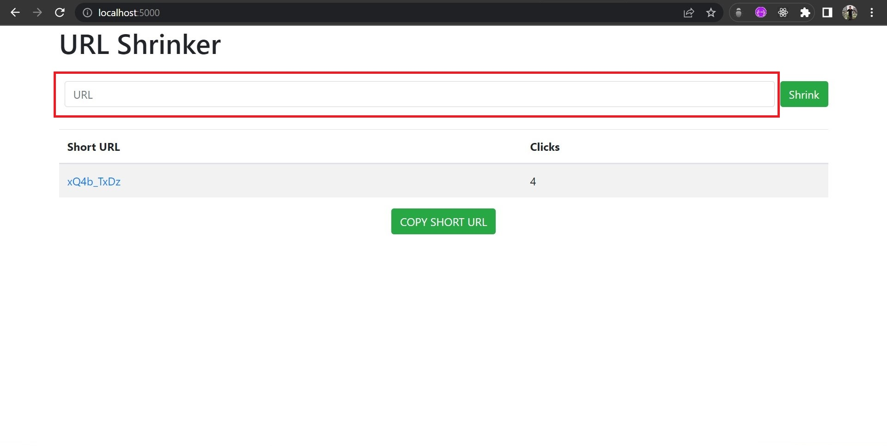
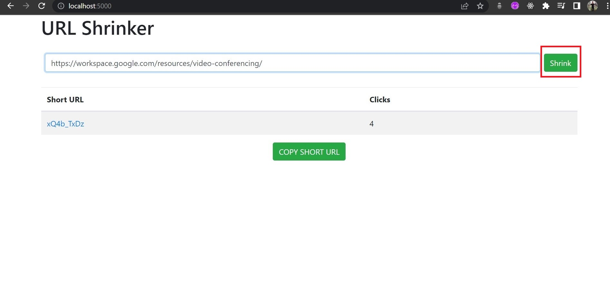
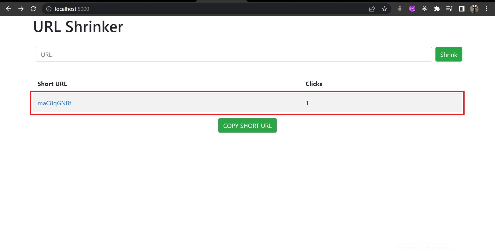
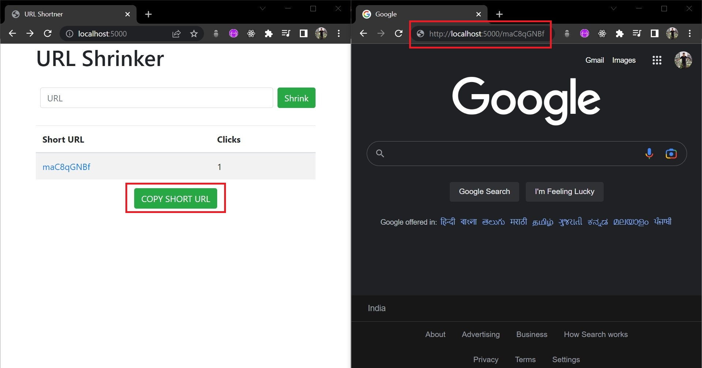

# URL-Shortner

This project shrinks the user specified URL with just a click of a button , this shrinked URL can then be easily copied onto the clipboard using a button embedded on the website.

## Installation

Use the node package manager [npm](https://www.npmjs.com/) to install all the packages mentioned in the package.json file

```bash
npm init
```

## Demo
A step-by-step guide to use the website

**Step 1** : Insert the URL in the URL textfield


               
                                   
                                   
**Step 2** : Press the Shrink button 


                                   
**Step 3** :The generated short Url is visoble in the table along with the number of times the link has been visited (this 'clicks' keeps on updating automatically),clicking on this URL will redirect the user to the appropraite location on the web                
          
  
                                  
**Step 4**  : The copy button present at the bottom of the shrinker can be used to copy the short url and paste it in any browser of the users choice
          
  
                                   
                                   
## Refernces used 
[ExpressJS API documentation](https://expressjs.com/en/4x/api.html)<br />
[Mongoose connecting to mongoDB](https://mongoosejs.com/docs/connections.html)<br />
[Express url encoded](https://www.geeksforgeeks.org/express-js-express-urlencoded-function/)<br />  
[Mongoose Schema](https://mongoosejs.com/docs/guide.html#schemas)<br />
[shortid - npm package](https://www.npmjs.com/package/shortid)<br />
[ejs -npm package](https://www.npmjs.com/package/ejs)<br />
[async and await in javascript](https://www.geeksforgeeks.org/async-await-function-in-javascript/)<br />
## Contributing

Pull requests are welcome. For major changes, please open an issue first
to discuss what you would like to change.

Please make sure to update tests as appropriate.
